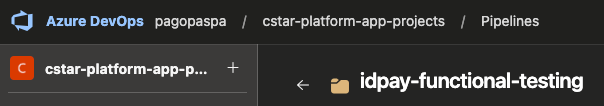
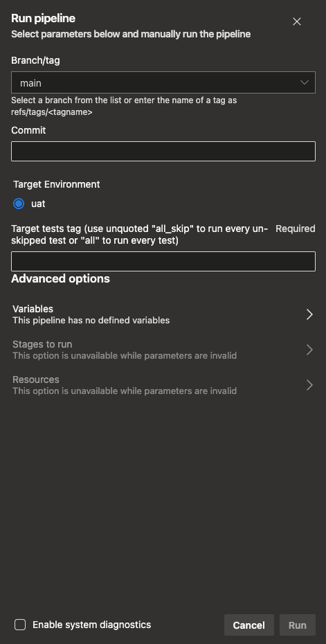

# IDPay Functional Testing

This repository contains functional tests for IDPay platform.
Test runs can be executed both with Azure DevOps or locally.

## Run on Azure DevOps

1. Go
   to `idpay-functional-testing` [pipeline](https://dev.azure.com/pagopaspa/cstar-platform-app-projects/_build?definitionScope=%5Cidpay%5Cidpay-functional-testing)\
   
2. Chose and click one of the 3 pipelines available:
   - `idpay-functional-testing.discount-flow`
   - `idpay-functional-testing.refund-flow`
   - `idpay-functional-testing.code-review`
3. On the upper right click on `Run pipeline`:\
   
4. Fill the fields according to the needs:\
   
6. Click `Run`

## Run on local environment

### Installation

Clone the repository:

```commandline
git clone https://github.com/pagopa/idpay-functional-testing.git
```

Enter the cloned repository:

```commandline
cd idpay-functional-testing
```

Create a virtual environment:

```commandline
python3 -m venv venv
```

Enter the virtual environment:

```commandline
source venv/bin/activate
```

Install dependencies:pip

```commandline
pip install -r requirements.txt
```

> **_NOTE_**: Create `.secret.yaml` based on `.secrets_semplate.yaml` and customize it.

## Usage

> Default target environment is **UAT**.

Run discount flow tests:

```commandline
[IDPAY_TARGET_ENV=<myenv>] behave [--junit --junit-directory <JUNIT_OUTPUT_DIR>] [--tags @<TEST_TAG>]
```

For example this command runs in UAT all suspension tests and save the junitxml report to a file:

```commandline
behave --junit --junit-directory "tests/reports/behave" --tags @suspension
```

Run discount flow tests:

```commandline
[IDPAY_TARGET_ENV=<myenv>] pytest [--junitxml=path/to/report.xml] [-vv] [-m "[not] <TEST_MARKER>"]
```

For example this command runs verbose in DEV all API test and save the junitxml report to a file:

```commandline
IDPAY_TARGET_ENV=dev pytest --junitxml=tests/reports/junit.xml -vv -m "API"
```
