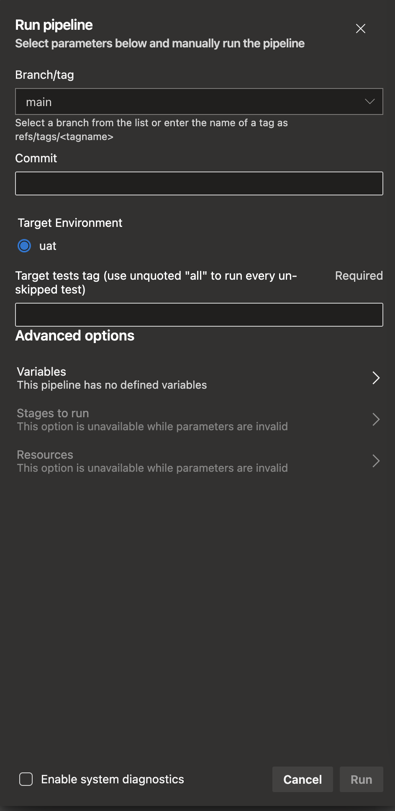

# IDPay Functional Testing

This repository contains functional tests for IDPay platform.
Test runs can be executed both with Azure DevOps or locally.

## Run on Azure DevOps

1. Go
   to `idpay-functional-testing` [pipeline](https://dev.azure.com/pagopaspa/cstar-platform-app-projects/_build?definitionScope=%5Cidpay%5Cidpay-functional-testing)\
   
2. Chose and click one of the 3 pipelines available:
   - `idpay-functional-testing.discount-flow`
   - `idpay-functional-testing.refund-flow`
   - `idpay-functional-testing.code-review`
3. On the upper right click on `Run pipeline`:\
   
4. Fill the fields according to the needs:\
   
   > Target tests tags can be separated by commas to include each scenario tagged with at least one of them.
5. Click `Run`

## Run on local environment

### Installation

Clone the repository:

```commandline
git clone https://github.com/pagopa/idpay-functional-testing.git
```

Enter the cloned repository:

```commandline
cd idpay-functional-testing
```

Install [pipenv](https://pipenv.pypa.io/en/latest/):

```
pip install pipenv
```

Create and enter the virtual environment:

```commandline
pipenv shell
```

Install dependencies:

```commandline
pipenv sync
```

> **_NOTE_**: Create `.secret.yaml` based on `.secrets_semplate.yaml` and customize it.

## Usage

> Default target environment is **UAT**.

Run discount flow tests:

```commandline
[IDPAY_TARGET_ENV=<myenv>] behave [--junit --junit-directory <JUNIT_OUTPUT_DIR>] [--tags @<[TEST_TAG/s]>]
```

For example this command runs in UAT all suspension tests and save the junitxml report to a file:

```commandline
behave --junit --junit-directory "tests/reports/behave" --tags @suspension,readmission
```

Run discount flow tests:

```commandline
[IDPAY_TARGET_ENV=<myenv>] pytest [--junitxml=path/to/report.xml] [-vv] [-m "[not] <TEST_MARKER>"]
```

For example this command runs verbose in DEV all API test and save the junitxml report to a file:

```commandline
IDPAY_TARGET_ENV=dev pytest --junitxml=tests/reports/junit.xml -vv -m "API"
```

## Local GitHub Pages

### Act

To locally build and deploy GitHub Pages you need to install [act](https://github.com/nektos/act) and make sure do have
a running Docker engine.

Then run:

```
act -W .github/workflows/pages_local.yaml -P python:latest=python:latest
```

> With M-series chip the addition argument `--container-architecture linux/amd64` is required.

At the end of the process a web page should be exposed to http://localhost:8080/.

---

### Mkdocs

To locally produce the documentation make sure to install [mkdocs](https://www.mkdocs.org/).
Then run:

```
python3 scenario_parser.py
```

to parse all the scenario and produce `.md` feature files.

Then build the documentation:

```
mkdocs build
```

At the end of the process you will find the output in `site` folder.
