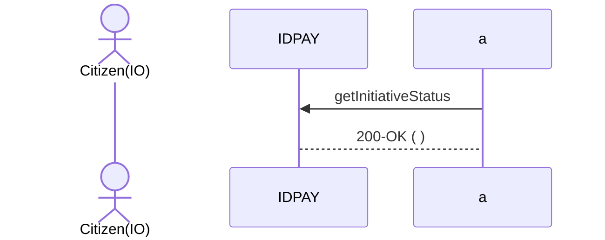

# Example Feature Description

this feature decription will use [mermaid syntax](https://mermaid.js.org/syntax/sequenceDiagram.html) in order to depict the following sequence diagram

```mermaid
      
sequenceDiagram

    actor cit as Citizen(IO)
    participant idpay as IDPAY
    a ->> idpay : getInitiativeStatus
    idpay --> a : 200-OK ( )
```

